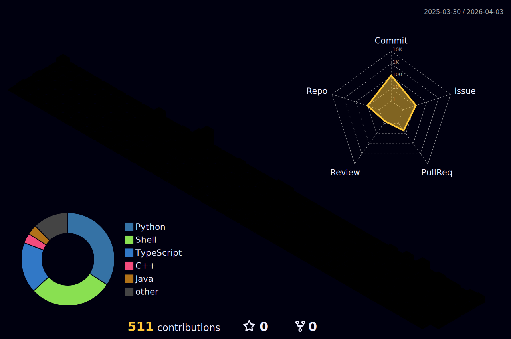

## Hi👋, I'm Douglas Fernandes

- 🤙 I’m currently learning > Javascript, Typescript, HTML, CSS, Python, Django, React.js, PostgreSQL
   
   

## Technologies I currently study

  
  
  
  
  
  
  

 

## ⚫ Stats

## 📱 Contact 🤙

